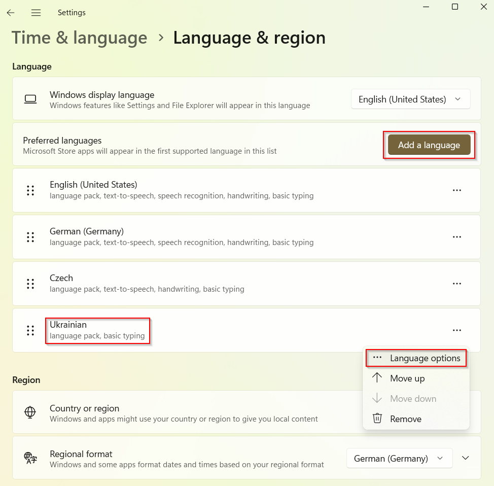
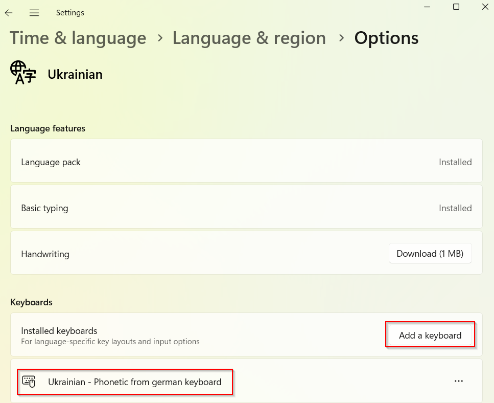

[](README.md)
[](README-DE.md)
[](README-UK.md)

# ukrdepho
Ein Windows Tastatur-Layout für die ukrainische Sprache, 
auf phonetischer Grundlage des deutschen Standard-Tastatur-Layouts.

## ToDo

Sowohl dieses Readme als auch das Layout selbst sind
Work in Progress. Dieser Abschnitt wird entfernt, sobald das
Layout fertig und von mindestens einem ukrainischen Natursprachler,
der auch gut deutsch spricht, abgenommen wurde.

## Installation

Laden Sie die neueste Release herunter, das ist derzeit
[Version 1.0](releases/ukrdepho-1.0.zip). Entpacken Sie das Archiv
in ein leeres Verzeichnis. Starten Sie `setup.exe`. Sie werden
aufgefordert, diesen Prozess mit Administratorrechten laufen zu lassen.
Stimmen Sie zu. Das Layout wird nun auf Ihrem Rechner installiert.

Aktivieren Sie in den Spracheinstellungen das ukrainische Sprachpaket,
sofern nicht bereits geschehen.



Sie haben dort die Auswahl zwischen
mehreren Tastaturen. Wählen Sie dort
`Ukrainian - Phonetic from german keyboard`.



Falls es Probleme mit der Aktivierung der Tastatur gibt, können folgende
Schritte hilfreich sein:

* UTF-8 für Windows aktivieren. Das ist ganz allgemein eine gute Idee
  für jeden, der mit mehr Sprachen als im westlichen Raum zu tun hat.


* Andere ukrainische Tastaturkonfigurationen vorübergehend deaktivieren
* Windows neu starten

## Motivation

Sowohl als Deutscher, der Ukrainisch lernen möchte, als auch als
Ukrainer in Deutschland hat man es nicht leicht, ukrainische Texte
zu tippen. Ukrainische Tastaturen sind schwer erhältlich, haben kein
einheitliches Layout und sind oft mit einem russischen Layout
kombiniert. Ein schnelles Umschalten zwischen deutschem und
ukrainischem Tippen ist nur schwer möglich, man muss dafür mindestens
eines der beiden Layouts Deutsch und Ukrainisch vollständig im Kopf
haben.

Für alle, die mit einer deutschen Tastatur arbeiten und kein
ukrainisches Layout fest im Gedächtnis haben, kann es von Vorteil
sein, sich an den auf der deutschen tastatur aufgedruckten Buchstaben
zu orientieren. Die meisten ukrainischen Buchstaben haben ja im
Deutschen eine 1:1 Entsprechung für denselben Laut.

Man benötigt also ein Layout, das den deutschen Tasten für die
ukrainische Sprache so weit wie möglich folgt. Windows 11 scheint
so etwas leider nicht anzubieten, daher gibt es nun hier eines als
Open Source. Das Layout wurde mit dem
[Microsoft Keyboard Layout Creator](https://www.microsoft.com/en-us/download/details.aspx?id=102134)
erstellt, als Basis diente das deutsche Standard-Layout.

## Zuordnung der Tasten

Die [deutsche Wikipedia](https://de.wikipedia.org/wiki/Umschrift_des_ukrainischen_kyrillischen_Alphabets#Tabellen_zu_den_verschiedenen_Umschrift-_und_Romanisierungsvarianten)
nennt die folgende übliche 'scholary' Umschrift 
für das ukrainische Alphabet:

```
А а	->	a
Б б	->	b
В в	->	v
Г г	->	h
Ґ ґ	->	g
Д д	->	d
Е е	->	e
Є є	->	je
Ж ж	->	ž
З з	->	z
И и	->	y
І і	->	i
Ї ї	->	ji
Й й	->	j
К к	->	k
Л л	->	l
М м	->	m
Н н	->	n
О о	->	o
П п	->	p
Р р	->	r
С с	->	s
Т т	->	t
У у	->	u
Ф ф	->	f
Х х	->	ch
Ц ц	->	c
Ч ч	->	č
Ш ш	->	š
Щ щ	->	šč
Ь ь	->	′
Ю ю	->	ju
Я я	->	ja
’	->	-
```

An dieser orientiere ich mich. Es gibt zwar auch eine 'deutsche'
Umschrift dort, die z.B. в als w statt v schreibt. Ich glaube aber,
dass die scholary-Variante für jeden, der sich auch mit slawischen
Sprachen mit lateinischer Schrift beschäftigt, eingänglicher ist.

Zusätzlich zum Standard-Alphabet unterstützen wir auch das Symbol
der ukrainischen Währung Hryvnia ₴.

In allen Fällen, in denen die Umschrift einen Buchstaben nennt,
der auf der deutschen Tastatur verfügbar ist, ordne ich die
entsprechende Taste zu. In den anderen Fällen habe ich folgende
Zuordnungen verwendet:

```
Х х	->	x ( klingt anders, sieht aber genauso aus)
Ш ш	->	w ( klingt anders, sieht aber ähnlich aus)
’	->	' ( Shift + #, sieht ähnlich aus wie das deutsche Apostroph )

Щ щ	->	q ( liegt direkt außen neben ш, analog zu ukrainischen Tastaturen)
		^ danach w bzw. ^ danach W
		AltGr + w (zusätzlich Shift für Großbuchstaben)
Я я	->	ä ( klingt anders, aber beides sind Varianten von a )
		^ danach a bzw. ^ danach A
		AltGr + a (zusätzlich Shift für Großbuchstaben)
Ж ж	->	ö (entspricht der Belegung auf ukrainichen Tastaturen)
		^ danach g bzw. ^ danach G
		AltGr + g (zusatzlich Shift für Großbuchstaben)
Ю ю	->	ü ( klingt anders, aber beides sind Varianten von u )
		^ danach u bzw. ^ danach U
		AltGr + u (zusätzlich Shift für Großbuchstaben)

Є є	->	^ danach e bzw. ^ danach E
		AltGr + e (zusätzlich Shift für Großbuchstaben)
Ї ї	->	^ danach i bzw. ^ danach I
		AltGr + i (zusätzlich Shift für Großbuchstaben)
Ч ч	->	^ danach c bzw. ^ danach C
		AltGr + c (zusätzlich Shift für Großbuchstaben)
Ь ь	->	^ danach b bzw. ^ danach B
		AltGr + b (zusätzlich Shift für Großbuchstaben)
₴	->	^ danach h
		AltGr + h
```

Wie man sieht, kann man in vielen Fällen denselben Buchstaben auf
unterschiedliche Weise erzeugen - je nach persönlichem Geschmack und
und je nachdem, was man sich am besten merken kann.

Die Systematik
für die Dach-Tot-Taste ^ ist, dass man mit ihr jeweils die passende
weiche Form bekommt. Im Fall von ж haben wir uns als Basis für g
entschieden, weil der entsprechende Laut im Wort 'Garage' dem
Deutschen näher liegt als das wissenschaftlich näherliegende z.

Die Tot-Taste ´ vor einem beliebigen Buchstaben (oder einem beliebigen
Buchstaben mit Shift, oder AltGr für das Eurozeichen €) 
erzeugt den deutschen Originalbuchstaben. Die Shift-Tot-Taste \` 
hat keine Funktion. Möchte man akzentuierte lateinische Buchstaben 
tippen, für die auf der deutschen Tastatur eine der Tot-Tasten ^, ´
oder \` benötigt wird, so muss man die Eingabesprache wechseln, 
etwa mit Shift+Alt.

## Rückmeldungen

Wenn Ihnen etwas am Layout nicht gefällt, können Sie es für sich selbst
leicht mit dem Microsoft Keyboard Layout Creator ändern (siehe oben).
Falls Sie der Meinung sind, dass Ihre Anpassung von allgemeinem
Interesse ist, freue ich mich über eine Rückmeldung unter
wolfgang.kronberg@gmail.com .

## Juristisches

Das Keyboard Layout is Open Source, entsprechend der sehr permissiven
[MIT License](LICENSE). Jeder ist eingeladen, es entsprechend zu
verwenden und weiterzugeben.

Die Symbolbilder aus diesem Readme stammen von
https://www.freeflagicons.com/ .
