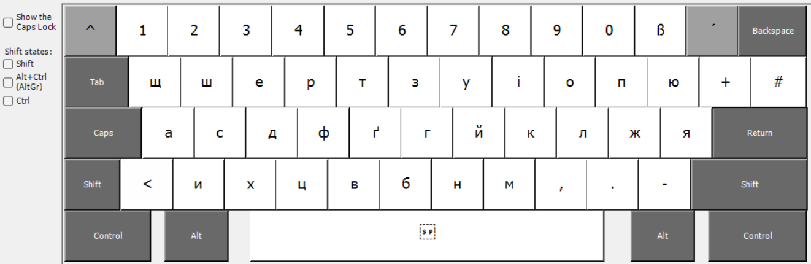
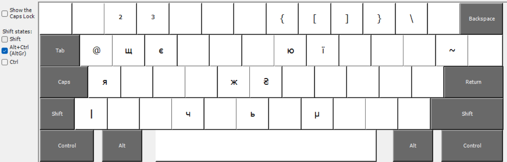

[](README.md)
[](README-DE.md)
[](README-UK.md)

# ukrdepho
Клавіатурна розкладка Windows для української мови, 
фонетично заснована на німецькій стандартній клавіатурній розкладці.

## ToDo

Як це readme, так і сама розкладка є
роботою в процесі. Цей розділ буде видалено, як тільки розкладка
буде завершена та схвалена принаймні одним українським носієм мови,
який також добре володіє німецькою.

## Розкладка

У цій розкладці українські літери розташовані там, де їх
інтуїтивно очікували б на клавіатурі з німецькою маркуванням.
Наприклад, ви знайдете `д` на клавіші `d` або `й` на
клавіші `j`, тому що це відповідає тому ж звуку в німецькій.
Ось як виглядає розкладка загалом (звичайна, з `Shift` та з `AltGr`):





## Встановлення

Завантажте найновішу версію, яка зараз є
[Версією 1.0](releases/ukrdepho-1.0.zip). Розархівуйте архів
у порожню директорію. Запустіть `setup.exe`. Вам буде
запропоновано запустити цей процес з правами адміністратора.
Погодьтеся з цим. Розкладка тепер буде встановлена на вашому комп'ютері.
Ви можете видалити директорію, в яку ви розархівували файли встановлення,
після завершення встановлення.

Активуйте український пакет мови в налаштуваннях мови,
якщо це ще не зроблено.


Там у вас є вибір між кількома клавіатурами. Виберіть
`Ukrainian - Phonetic from german keyboard`.


Якщо є проблеми з активацією клавіатури, можуть бути корисними
наступні кроки:

* Активуйте UTF-8 для Windows. Це загалом хороша ідея
  для кожного, хто має справу з більшою кількістю мов, ніж ті, що в західному світі.


* Тимчасово відключіть інші українські конфігурації клавіатури
* Перезавантажте Windows

## Мотивація

Як німцю, який хоче вивчити українську, так і українцю
в Німеччині нелегко друкувати українські тексти.
Українські клавіатури важко отримати, не мають єдиної
розкладки та часто поєднуються з російською розкладкою.
Швидке перемикання між німецьким та українським друкуванням утруднено;
вам потрібно мати принаймні одну з двох розкладок (німецьку та українську)
повністю запам'ятовану.

Для всіх, хто працює з німецькою клавіатурою та не має
української розкладки твердо запам'ятованою, може бути вигідно
орієнтуватися на літери, надруковані на німецькій клавіатурі.
Адже більшість українських літер мають 1:1 відповідність
для того ж звуку в німецькій.

Тому вам потрібна розкладка, яка слідує німецьким клавішам для
української мови якомога більше. Windows 11, на жаль,
не здається пропонувати таке, тому тепер тут є одна як
відкритий код. Розкладка була створена за допомогою
[Microsoft Keyboard Layout Creator](https://www.microsoft.com/en-us/download/details.aspx?id=102134),
використовуючи німецьку стандартну розкладку як основу.

## Призначення клавіш

[Німецька Вікіпедія](https://de.wikipedia.org/wiki/Umschrift_des_ukrainischen_kyrillischen_Alphabets#Tabellen_zu_den_verschiedenen_Umschrift-_und_Romanisierungsvarianten)
згадує наступну звичайну 'scholarly' транслітерацію
для українського алфавіту:

```
А а	->	a
Б б	->	b
В в	->	v
Г г	->	h
Ґ ґ	->	g
Д д	->	d
Е е	->	e
Є є	->	je
Ж ж	->	ž
З з	->	z
И и	->	y
І і	->	i
Ї ї	->	ji
Й й	->	j
К к	->	k
Л л	->	l
М м	->	m
Н н	->	n
О о	->	o
П п	->	p
Р р	->	r
С с	->	s
Т т	->	t
У у	->	u
Ф ф	->	f
Х х	->	ch
Ц ц	->	c
Ч ч	->	č
Ш ш	->	š
Щ щ	->	šč
Ь ь	->	′
Ю ю	->	ju
Я я	->	ja
'	->	-
```

Я орієнтуюся на це. Там також є 'німецька' транслітерація,
яка пише `в` як `w` замість `v`. Однак я вважаю, що
науковий варіант більш інтуїтивний для кожного, хто також має справу
зі слов'янськими мовами з латинським письмом.

На додаток до стандартного алфавіту ми також підтримуємо символ
української валюти Гривня ₴.

У всіх випадках, коли транслітерація називає літеру, яка
доступна на німецькій клавіатурі, я призначаю відповідну клавішу.
В інших випадках я використав наступні призначення:

```
Х х	->	x ( звучить інакше, але виглядає так само)
Ш ш	->	w ( звучить інакше, але виглядає подібно)
ʼ	->	' ( Shift + #, виглядає подібно до німецького апострофа )

Щ щ	->	q ( лежить безпосередньо зовні поруч з ш, аналогічно до українських клавіатур)
		^ потім w або ^ потім W
		AltGr + w (додатково Shift для великих літер)
Я я	->	ä ( звучить інакше, але обидва є варіантами a )
		^ потім a або ^ потім A
		AltGr + a (додатково Shift для великих літер)
Ж ж	->	ö (відповідає призначенню на українських клавіатурах)
		^ потім g або ^ потім G
		AltGr + g (додатково Shift для великих літер)
Ю ю	->	ü ( звучить інакше, але обидва є варіантами u )
		^ потім u або ^ потім U
		AltGr + u (додатково Shift для великих літер)

Є є	->	^ потім e або ^ потім E
		AltGr + e (додатково Shift для великих літер)
Ї ї	->	^ потім i або ^ потім I
		AltGr + i (додатково Shift для великих літер)
Ч ч	->	^ потім c або ^ потім C
		AltGr + c (додатково Shift для великих літер)
Ь ь	->	^ потім b або ^ потім B
		AltGr + b (додатково Shift для великих літер)
₴	->	^ потім h
		AltGr + h
```

Як бачите, у багатьох випадках ви можете генерувати ту саму літеру
різними способами - залежно від особистого смаку та того,
що ви можете найкраще запам'ятати.

Систематика для мертвої клавіші `^` полягає в тому, що ви отримуєте відповідну
м'яку форму з нею. У випадку `ж` ми вирішили `g` як основу,
тому що відповідний звук у слові 'Garage' ближчий до
німецької, ніж науково ближчий `z`.

Мертва клавіша `´` перед будь-якою літерою (або будь-якою літерою
з `Shift`, або `AltGr` для символу Євро `€`)
виробляє німецьку оригінальну літеру. `Shift` мертва клавіша `` ` `` 
не має функції. Якщо ви хочете друкувати акцентовані латинські літери,
для яких потрібна одна з мертвих клавіш `^`, `´` або `` ` `` на німецькій клавіатурі,
ви повинні переключити мову введення, наприклад, з `Shift+Alt`.

## Відгуки

Якщо вам щось не подобається в розкладці, ви можете легко
змінити це для себе за допомогою Microsoft Keyboard Layout Creator (див. вище).
Вихідний код доступний у каталозі `/src/`.
Якщо ви вважаєте, що ваша адаптація становить загальний інтерес, я буду радий
отримати відгук на wolfgang.kronberg@gmail.com.

## Юридичні зауваження

Клавіатурна розкладка є відкритим кодом, відповідно до дуже ліберальної
[ліцензії MIT](LICENSE). Кожен запрошений використовувати та розповсюджувати її відповідно.

Символьні зображення з цього readme походять з
https://www.freeflagicons.com/ .
