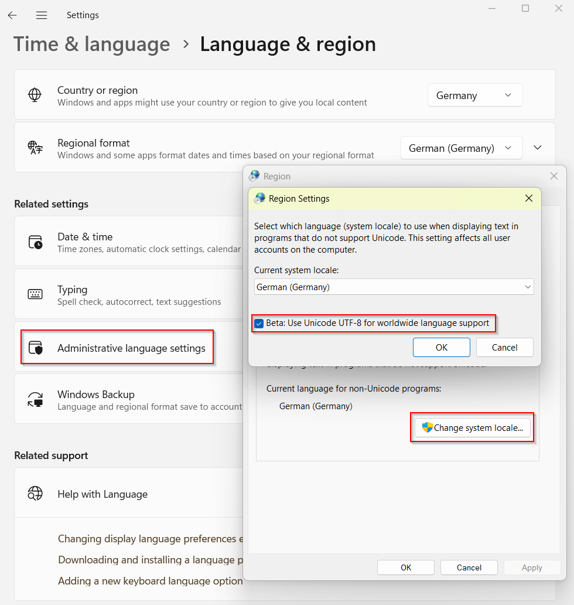

[](README.md)
[](README-DE.md)
[](README-UK.md)

# ukrdepho
A Windows keyboard layout for the Ukrainian language, 
phonetically based on the German standard keyboard layout.

## ToDo

Both this readme and the layout itself are
work in progress. This section will be removed once the
layout is complete and has been approved by at least one
Ukrainian native speaker who also speaks German well.

## The Layout

In this layout, Ukrainian letters are positioned where one
would intuitively expect them on a keyboard with German labeling.
For example, you'll find `д` on the `d` key or `й` on the
`j` key, because these represent the same sound in German.
Here's how the layout looks overall (normal, with `Shift`,
and with `AltGr`):


## Installation

Download the latest version, which is currently
[Version 1.0](releases/ukrdepho-1.0.zip). Extract the archive
into an empty directory. Start `setup.exe`. You will be
prompted to run this process with administrator privileges.
Agree to this. The layout will now be installed on your computer.
You can delete the directory where you extracted the installation files
after the installation is complete.

Activate the Ukrainian language pack in the language settings,
if not already done.


You have the choice between several keyboards there. Select
`Ukrainian - Phonetic from german keyboard`.


If there are problems activating the keyboard, the following
steps may be helpful:

* Activate UTF-8 for Windows. This is generally a good idea
  for anyone who deals with more languages than those in the Western world.



* Temporarily disable other Ukrainian keyboard configurations
* Restart Windows

## Motivation

Both as a German who wants to learn Ukrainian, and as a
Ukrainian in Germany, it's not easy to type Ukrainian texts.
Ukrainian keyboards are hard to obtain, don't have a uniform
layout, and are often combined with a Russian layout.
Quick switching between German and Ukrainian typing is difficult;
you need to have at least one of the two layouts (German or Ukrainian)
completely memorized.

For everyone who works with a German keyboard and doesn't have
a Ukrainian layout firmly memorized, it can be advantageous
to orient oneself to the letters printed on the German keyboard.
After all, most Ukrainian letters have a 1:1 correspondence
for the same sound in German.

So you need a layout that follows the German keys for the
Ukrainian language as much as possible. Windows 11 unfortunately
doesn't seem to offer such a thing. That's the gap `ukrdepho`
strives to close. The layout was created with the
[Microsoft Keyboard Layout Creator](https://www.microsoft.com/en-us/download/details.aspx?id=102134),
using the German standard layout as a basis.

## Key Assignments

The [German Wikipedia](https://de.wikipedia.org/wiki/Umschrift_des_ukrainischen_kyrillischen_Alphabets#Tabellen_zu_den_verschiedenen_Umschrift-_und_Romanisierungsvarianten)
mentions the following common 'scholarly' transliteration
for the Ukrainian alphabet:

```
А а	->	a
Б б	->	b
В в	->	v
Г г	->	h
Ґ ґ	->	g
Д д	->	d
Е е	->	e
Є є	->	je
Ж ж	->	ž
З з	->	z
И и	->	y
І і	->	i
Ї ї	->	ji
Й й	->	j
К к	->	k
Л л	->	l
М м	->	m
Н н	->	n
О о	->	o
П п	->	p
Р р	->	r
С с	->	s
Т т	->	t
У у	->	u
Ф ф	->	f
Х х	->	ch
Ц ц	->	c
Ч ч	->	č
Ш ш	->	š
Щ щ	->	šč
Ь ь	->	′
Ю ю	->	ju
Я я	->	ja
'	->	-
```

This is the version I follow. There is also a 'German' transliteration
there that writes, e.g., в as w instead of v. However, we believe that
the scholarly variant is more intuitive for anyone who also deals
with Slavic languages with Latin script.

In addition to the standard alphabet, we also support the symbol
of the Ukrainian currency Hryvnia ₴.

In all cases where the transliteration names a letter that
is available on the German keyboard, we assign the corresponding key.
In the other cases, we have used the following assignments:

```
Х х	->	x ( sounds different, but looks the same)
Ш ш	->	w ( sounds different, but looks similar)
’	->	' ( Shift + #, looks similar to the German apostrophe )

Щ щ	->	q ( off-center immediately next to ш, analogous to Ukrainian keyboards)
		^ then w or ^ then W
		AltGr + w (additionally Shift for uppercase)
Я я	->	ä ( sounds different, but both are variants of a )
		^ then a or ^ then A
		AltGr + a (additionally Shift for uppercase)
Ж ж	->	ö (corresponds to the assignment on Ukrainian keyboards)
		^ then g or ^ then G
		AltGr + g (additionally Shift for uppercase)
Ю ю	->	ü ( sounds different, but both are variants of u )
		^ then u or ^ then U
		AltGr + u (additionally Shift for uppercase)

Є є	->	^ then e or ^ then E
		AltGr + e (additionally Shift for uppercase)
Ї ї	->	^ then i or ^ then I
		AltGr + i (additionally Shift for uppercase)
Ч ч	->	^ then c or ^ then C
		AltGr + c (additionally Shift for uppercase)
Ь ь	->	^ then b or ^ then B
		AltGr + b (additionally Shift for uppercase)
₴	->	^ then h
		AltGr + h
```

As you can see, in many cases you can generate the same letter
in different ways - depending on personal taste and what you
can remember best.

The systematics for the dead key `^` is that you get the appropriate
soft form with it. In the case of `ж`, we decided on `g` as the basis
because the corresponding sound in the word 'Garage' is closer to
German than the scientifically closer `z`.

The dead key `´` before any letter (or any letter with `Shift`, or 
`AltGr` for the Euro symbol `€`) produces the German original letter.
The Shift dead key `` ` `` has no function. If you want to type 
accented Latin letters for which one of the dead keys `^`, `´` or 
`` ` `` is needed on the German keyboard,
you must switch the input language, for example with `Shift+Alt`.

## Feedback

If you don't like something about the layout, you can easily
change it for yourself with the Microsoft Keyboard Layout Creator (see above).
If you believe your adjustment to be of general interest, I'd be happy
to receive feedback at wolfgang.kronberg@gmail.com.

## Legal

The keyboard layout is open source, under the very permissive
[MIT License](LICENSE). Everyone is invited to use and distribute it accordingly.

The symbol images from this readme originate from
https://www.freeflagicons.com/ .
